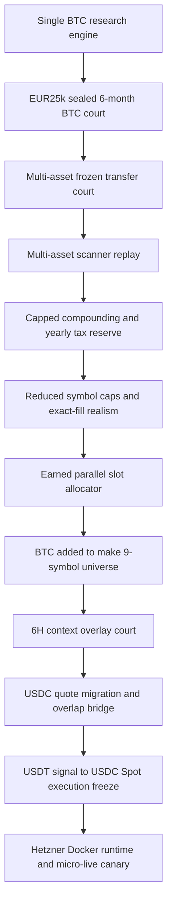
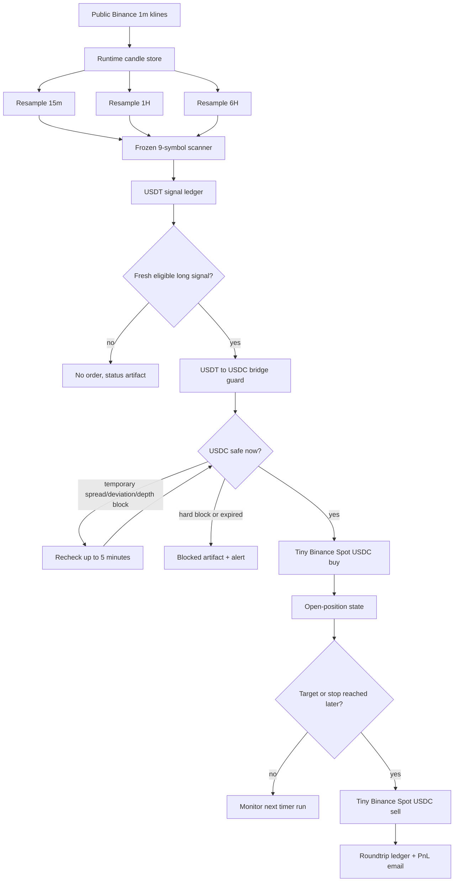
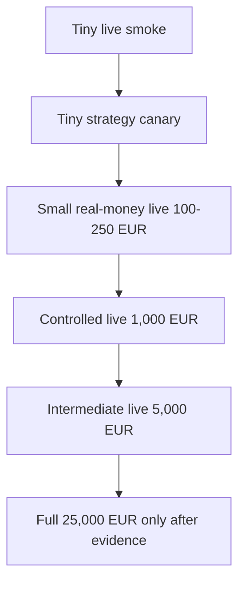

# Crypto Compounding Engine

Production-grade, Dockerized crypto compounding runtime for Hetzner.

This repository is the cleaned production extraction of the larger local research workspace. It is not the legacy Retail Trading System application. It is the operational Crypto Compounding Engine: public market data in, deterministic frozen signal logic, clear artifacts out, guarded Binance Spot execution only when explicitly enabled.

Current status: guarded 100 USDC micro-live canary is ready and running on Hetzner with capped USDC execution. Full €25,000 deployment is not a switch; it is a gated promotion after the canary proves order lifecycle, state recovery, email clarity, and balance reconciliation.

---

## Table of contents

| Section | What it explains |
| --- | --- |
| [Executive verdict](#executive-verdict) | The current operating answer in one table: cloud, universe, USDT/USDC route, safety posture, and live mode. |
| [Current frozen production candidate](#current-frozen-production-candidate) | The exact frozen candidate currently deployed: 9 symbols, 1m/15m/1H/6H context, long-only Spot execution, and research numbers. |
| [Historical evidence before deployment](#historical-evidence-before-deployment) | The full research path before Hetzner: single-asset transfer, multi-asset scanner, capped compounding, BTC inclusion, 6H overlay, USDC bridge, and final freeze. |
| [Per-asset full-history transfer records](#per-asset-full-history-transfer-records) | What each asset did independently under the frozen transfer court, including research and sealed-holdout net-cost equity. |
| [Multi-asset engine evolution](#multi-asset-engine-evolution) | How the system moved from isolated assets to a realistic capped multi-asset allocator. |
| [USDT signal and USDC execution evidence](#usdt-signal-and-usdc-execution-evidence) | Why USDT remains the signal source, why USDC is the live execution route, and which numbers justify the bridge. |
| [5-minute USDC execution patience guard](#5-minute-usdc-execution-patience-guard) | The locked execution guard that waits briefly for safe USDC spread/deviation/depth without changing the frozen strategy. |
| [A+/Elite conviction sizing court](#aelite-conviction-sizing-court) | The research-only sizing upgrade: same frozen signals, larger risk only for A+/Elite signals, drawdown episodes, and max historical sizing. |
| [Why USDT signals and USDC execution](#why-usdt-signals-and-usdc-execution) | The conceptual reason for separating signal tape from execution quote. |
| [System flow](#system-flow) | Mermaid chart of live data → frozen signal → guarded USDC canary execution. |
| [Hetzner production layout](#hetzner-production-layout) | Docker services, systemd timer, and persistent volumes. |
| [Runtime artifact map](#runtime-artifact-map) | Where ledgers, status files, candle snapshots, order fills, roundtrips, and email artifacts are written. |
| [Email streams](#email-streams) | Difference between signal emails and real Binance canary order emails. |
| [Latest operational changes](#latest-operational-changes) | The newest production fixes: stale canary-entry block, 1-minute canary checks, demo shutdown, and current Hetzner status. |
| [EUR-native investigation](#eur-native-investigation) | Why EUR pairs are being tested, what completed so far, and why EUR-native is not yet the production route. |
| [What “ready to trade real money” means here](#what-ready-to-trade-real-money-means-here) | What is approved now, what is still gated, and why full €25k is not enabled yet. |
| [Promotion ladder](#promotion-ladder) | The staged path from tiny smoke to canary to small capital to full capital. |
| [Hard safety contract](#hard-safety-contract) | The non-negotiable disabled paths and live risk caps. |
| [Repository hygiene status](#repository-hygiene-status) | Why some research-looking modules remain and what generated clutter is excluded. |
| [Folder structure](#folder-structure) | Production repo layout and purpose of each main folder. |
| [Hetzner commands](#hetzner-commands) | Basic server commands for runtime, logs, and live canary status. |
| [Runbooks](#runbooks) | Supporting operational documents. |
| [Final conclusion](#final-conclusion) | The final engineering interpretation of the project state. |

---

## Executive verdict

| Area | Current answer |
| --- | --- |
| Production repo | `nneupane1/Crypto-Compounding-Engine` |
| Cloud target | Hetzner CPX22, Falkenstein, Docker Compose |
| Active strategy universe | 9 symbols |
| Signal quote route | USDT |
| Live execution quote route | USDC |
| Runtime cadence | runtime loop continuous; live canary checks every 1 minute |
| Data source | public unsigned Binance klines |
| Execution product | Binance Spot only |
| Short selling | disabled for live execution |
| Margin/futures | disabled |
| Withdrawals/transfers | disabled |
| Current real-money mode | guarded 100 USDC micro-live canary only |
| Full €25k live mode | not enabled yet |

The main production idea is simple:

```text
USDT market signal brain  ->  USDC live execution hand
```

The engine watches the deeper USDT markets because they have better historical continuity and stronger research evidence. For live EEA/Binance access, it executes through matching USDC Spot pairs because that is the practical route available in the account environment.

That split is not a hack. It is the useful engineering compromise: keep the best signal source, execute through the allowed live route, and verify the bridge with hard evidence.

---

## Current frozen production candidate

| Item | Value |
| --- | --- |
| Frozen court | `multi_asset_earned_parallel_slot_btc_inclusion_court_001` |
| Universe id | `btc_research_ranked_9_symbol` |
| Classification | `MULTI_ASSET_9_SYMBOL_BTC_INCLUSION_FREEZE_CANDIDATE_RESEARCH_ONLY` |
| USDT → USDC bridge classification | `USDT_SIGNAL_USDC_EXECUTION_2PCT_GUARDED_CANDIDATE_FROZEN_RESEARCH_ONLY` |
| Active symbols | `ADAUSDT`, `LINKUSDT`, `BNBUSDT`, `XRPUSDT`, `AVAXUSDT`, `DOGEUSDT`, `ETHUSDT`, `BTCUSDT`, `SOLUSDT` |
| Context frames | `1m`, `15m`, `1H`, `6H` |
| 6H overlay | `MULTI_ASSET_6H_CONTEXT_OVERLAY_FREEZE_CANDIDATE_RESEARCH_ONLY` |
| Execution style | long-only Binance Spot for live/canary |
| Research result after costs + yearly tax reserve | `€5,393,682.06` from `€25,000` |
| Bridge research result after costs + yearly tax reserve before live guard filtering | `€5,333,441.95` from `€25,000` |
| Locked live execution guard | symbol-aware USDC execution safety with `5m` patience |
| Live canary freshness guard | blocks stale entries, already-closed shadow trades, and target/stop-resolved late entries |
| 5m patience-guard research estimate after costs + yearly tax reserve | `€4,115,595.94` from `€25,000` |
| 5m patience-guard sealed holdout | `€110,226.24` from `€25,000` |
| A+/Elite conviction sizing research after costs + yearly tax reserve | `€15,488,951.85` from `€25,000` |
| A+/Elite conviction sizing sealed holdout after costs + yearly tax reserve | `€714,359.35` from `€25,000` |

The important number is not a fantasy “gross moon number”. The relevant production-candidate research range first settled around the cost-aware, tax-reserve-aware USDT-signal → USDC-execution result of `€5.33M–€5.39M` from a `€25k` starting anchor. After the A+/Elite conviction sizing court, the same frozen signal ledger improved to `€15.49M` research and `€714.36k` sealed holdout. This is a sizing candidate, not a permission switch for full live capital.

That is why this version is the current production candidate.

---

## Historical evidence before deployment

Before this repository was separated and deployed to Hetzner, the engine went
through a long sequence of research-only courts. The purpose was not to make a
pretty equity curve. The purpose was to find the version that survived:

- full-history replay;
- sealed six-month holdout;
- net execution costs;
- yearly German tax-reserve modeling;
- no short-selling for live Spot execution;
- capped compounding;
- symbol-level capacity limits;
- USDT signal to USDC execution conversion;
- cloud runtime and tiny real-money canary safety gates.

The research evolution looked like this:



The important lesson from this path: the early huge single-asset and uncapped
multi-asset numbers were treated as evidence of edge, not as production cash
forecasts. The final production candidate is the capped, long-only,
cost-aware, tax-reserve-aware, USDC-executable bridge.

---

## Per-asset full-history transfer records

These were the first major multi-asset transfer results. Each asset was tested
independently with the frozen transfer logic, normal net-cost model, and a
fresh sealed holdout. These numbers explain why the project moved beyond a
single BTC-only engine.

Source artifact:

```text
structural_compounding_lab/output/multi_asset_frozen_transfer_court_001/
multi_asset_frozen_transfer_summary.json
```

| Symbol | Research net-cost equity | Research trades | Research PF | Research win rate | Sealed-holdout net-cost equity | Holdout trades | Holdout PF | Holdout win rate |
| --- | ---: | ---: | ---: | ---: | ---: | ---: | ---: | ---: |
| `ETHUSDT` | `€4,119,551.82` | `458` | `12.26` | `76.64%` | `€31,626.86` | `37` | `10.63` | `78.38%` |
| `BNBUSDT` | `€9,375,952.90` | `526` | `11.74` | `77.57%` | `€36,788.82` | `37` | `19.87` | `78.38%` |
| `XRPUSDT` | `€6,284,678.64` | `491` | `16.77` | `81.06%` | `€32,088.11` | `43` | `4.59` | `67.44%` |
| `ADAUSDT` | `€46,269,286.92` | `580` | `22.95` | `86.03%` | `€30,420.50` | `27` | `9.06` | `77.78%` |
| `LINKUSDT` | `€11,063,301.24` | `501` | `15.76` | `80.84%` | `€39,036.98` | `43` | `17.82` | `79.07%` |
| `DOGEUSDT` | `€4,218,881.40` | `396` | `19.14` | `83.33%` | `€38,632.56` | `50` | `17.64` | `80.00%` |
| `SOLUSDT` | `€2,251,905.22` | `393` | `16.68` | `81.17%` | `€33,549.62` | `32` | `13.64` | `81.25%` |
| `AVAXUSDT` | `€4,848,859.05` | `416` | `16.91` | `79.57%` | `€33,781.08` | `43` | `6.20` | `74.42%` |

Portfolio-level transfer view:

| Metric | Value |
| --- | ---: |
| Assets validated | `8 / 8` |
| Average research ending equity | `€11,054,052.15` |
| Median research ending equity | `€5,566,768.84` |
| Average sealed-holdout ending equity | `€34,490.57` |
| Median sealed-holdout ending equity | `€33,665.35` |
| Best holdout asset | `LINKUSDT` |
| Worst holdout asset | `ADAUSDT` |

Interpretation: ADA’s full-history number was huge, but its sealed holdout was
not the strongest. That is why the system did not simply “freeze ADA”. The
better engineering move was a multi-asset scanner and allocator.

---

## Multi-asset engine evolution

The multi-asset engine became the production candidate only after the raw
scanner result was forced through increasingly realistic constraints.

| Court / stage | What changed | Research result | Sealed holdout | Classification |
| --- | --- | ---: | ---: | --- |
| Scanner replay | Fixed research-ranked scanner, one active trade, no live path | raw uncapped result demoted as non-cash forecast | `€134,917.30` | `MULTI_ASSET_SCANNER_REPLAY_VALIDATED_RESEARCH_ONLY` |
| Capital-cap realism | Added active-cap limit, profit vault, 15 bps cost, yearly tax reserve | `€4,391,717.30` | `€134,917.30` no-tax holdout diagnostic | `MULTI_ASSET_CAPITAL_CAP_REALISM_VALIDATED_RESEARCH_ONLY` |
| Reduced exact-fill caps | Added symbol-level fill-calibrated caps | `€5,017,411.26` | `€119,978.81` no-tax holdout diagnostic | `MULTI_SYMBOL_REDUCED_CAP_GEAR_LADDER_RESTATEMENT_PASSED_RESEARCH_ONLY` |
| Earned parallel slots, 8 symbols | Slots unlock from closed equity milestones only | `€6,796,470.63` | `€76,810.37` | `MULTI_ASSET_EARNED_PARALLEL_SLOT_FREEZE_CANDIDATE_RESEARCH_ONLY` |
| BTC inclusion, 9 symbols | Added BTC as a separate court, not by mutating the 8-symbol result | `€7,973,114.87` | `€87,951.93` | `MULTI_ASSET_9_SYMBOL_BTC_INCLUSION_FREEZE_CANDIDATE_RESEARCH_ONLY` |
| 6H context overlay | Tested 6H context as an overlay, not a native 6H execution rewrite | `€8,172,676.50` | `€90,209.37` | `MULTI_ASSET_6H_CONTEXT_OVERLAY_FREEZE_CANDIDATE_RESEARCH_ONLY` |
| USDT signal → USDC execution bridge | Preserved USDT signal tape, mapped live execution to USDC Spot pairs | `€5,333,441.95` baseline bridge / `€5,393,682.06` frozen 2% allocator | `€63,021.19` baseline bridge / `€110,226.24` frozen 2% allocator | `USDT_SIGNAL_USDC_EXECUTION_2PCT_GUARDED_CANDIDATE_FROZEN_RESEARCH_ONLY` |
| 5m USDC execution patience guard | Waits briefly only for temporary USDC spread/deviation/depth to become safe; strategy signal unchanged | `€4,115,595.94` | `€110,226.24` | `EXECUTION_PATIENCE_GUARD_CANDIDATE_IMPROVED_RESEARCH_ONLY` |
| A+/Elite conviction sizing | Same frozen signal ledger; only risk allocation changes by setup quality | `€15,488,951.85` | `€714,359.35` | `A_PLUS_CONVICTION_SIZING_FREEZE_CANDIDATE_PASSED_RESEARCH_ONLY` |

The progression matters. The engine did not jump from “large backtest” to
“trade €25k live”. It went through constraints that made the numbers smaller
and more credible:

- capped active trading capital;
- profit vault;
- yearly tax reserve;
- symbol capacity caps;
- closed-equity-only slot unlocks;
- no floating-PnL slot unlocks;
- long-only Spot-compatible execution;
- USDC execution bridge;
- tiny real-money canary before full capital.

---

## USDT signal and USDC execution evidence

The final production route is:

```text
USDT signal source -> frozen long-only 9-symbol scanner -> USDC Spot execution
```

This exists because Binance/EU account access made USDC the practical Spot
execution route, while USDT remained the better historical signal tape.

| Evidence item | Value |
| --- | --- |
| Canonical USDT 9-symbol research after cost + yearly tax reserve | `€7,973,114.87` |
| Canonical USDT 9-symbol sealed holdout after cost + yearly tax reserve | `€87,951.93` |
| USDT-signal → USDC-execution baseline bridge research | `€5,333,441.95` |
| USDT-signal → USDC-execution baseline bridge holdout | `€63,021.19` |
| Frozen 2% USDC allocator research | `€5,393,682.06` |
| Frozen 2% USDC allocator holdout | `€110,226.24` |
| Locked 5m execution-patience guard research | `€4,115,595.94` |
| Locked 5m execution-patience guard holdout | `€110,226.24` |
| A+/Elite conviction sizing research | `€15,488,951.85` |
| A+/Elite conviction sizing holdout | `€714,359.35` |
| Frozen allocator variant | `early_two_1pct_each_total_2pct` |
| Max slots from start | `2` |
| Max risk per trade | `1%` |
| Max total open risk from start | `2%` |
| Frozen classification | `USDT_SIGNAL_USDC_EXECUTION_2PCT_GUARDED_CANDIDATE_FROZEN_RESEARCH_ONLY` |

---

## A+/Elite conviction sizing court

The A+/Elite court answers one narrow question:

```text
If the exact same frozen strategy signals happen, what if higher-conviction
signals receive larger risk allocation?
```

It does not change:

- EMA/VWAP/structure/liquidity/breakout logic;
- entries;
- exits;
- thresholds;
- timeframe resampling;
- USDT signal generation;
- USDC execution bridge;
- long-only Spot constraint.

It changes only the risk allocation after a frozen signal already exists.

Source artifact:

```text
structural_compounding_lab/output/a_plus_conviction_sizing_court_001/
a_plus_conviction_sizing_summary.json
```

Classification:

```text
A_PLUS_CONVICTION_SIZING_FREEZE_CANDIDATE_PASSED_RESEARCH_ONLY
```

Sizing profile:

| Signal tier | Rule | Risk allocation |
| --- | --- | ---: |
| Normal | all accepted signals not classified as A+ or elite | `1.00%` |
| A+ | `setup_class=A` or `convexity_label=strong_convexity` | `2.50%` |
| Elite | `convexity_label=elite_convexity` | `3.00%` |

Portfolio risk ladder:

| Active equity threshold | Max slots | Max total open risk |
| ---: | ---: | ---: |
| `€0` | `2` | `5.00%` |
| `€100,000` | `3` | `7.50%` |
| `€300,000` | `5` | `10.00%` |

Result comparison:

| Scenario | Research after costs + yearly tax reserve | Sealed holdout after costs + yearly tax reserve |
| --- | ---: | ---: |
| Frozen 1% reference | `€5,393,682.06` | `€110,226.24` |
| A+/Elite conviction sizing | `€15,488,951.85` | `€714,359.35` |

Trade counts:

| Period | Candidate trades | Selected trades |
| --- | ---: | ---: |
| Research | `2,650` | `2,647` |
| Sealed holdout | `270` | `257` |

Drawdown detail:

| Period | Peak | Trough | Fall | Trade-driven drawdown | Recovery |
| --- | ---: | ---: | ---: | ---: | --- |
| Research | `€2,957,089.53` on `2019-12-31 20:00 UTC` | `€1,571,438.31` on `2020-01-09 08:00 UTC` | `-€1,385,651.22` | `-46.86%` | recovered by `2020-05-13 06:00 UTC`, about `125` days after trough |
| Sealed holdout | `€554,511.81` on `2026-04-17 19:00 UTC` | `€429,681.98` on `2026-04-22 23:00 UTC` | `-€124,829.83` | `-22.51%` | recovered by `2026-05-07 18:00 UTC`, about `15` days after trough |

Official max drawdown can look larger because the accounting model reserves tax
at year-end. That is capital leaving the trading account for tax planning, not
a trade-by-trade strategy loss. The model compounds trade PnL through the year
and applies the German tax reserve annually.

Largest historical sizing examples:

| Measure | Value |
| --- | ---: |
| Highest risk amount used by the court | `€15,000.00` |
| Signal | `BTCUSDT`, elite tier, `2019-04-25 05:00 UTC` entry |
| Largest estimated position notional from tight-stop replay math | about `€9,993,954.99` |
| Signal | `BTCUSDT`, elite tier, `2025-09-13 07:00 UTC` entry |

The notional figure is a research estimate derived from risk divided by stop
distance. Production now uses the same A+/Elite sizing formula for canary
calculation, scaled to the real canary account equity, then clamped by hard tiny
live limits. Current live canary remains micro-capped by environment controls:
up to two open positions, about `47.50 USDC` per order, `100 USDC` total test
budget, and a `25 USDC` daily closed-loss cap.

Live canary sizing formula:

```text
conviction_risk_amount = live_account_equity * tier_risk_pct
target_notional        = conviction_risk_amount / stop_distance_pct
actual_order_notional  = min(target_notional, per_order_cap, remaining_test_budget)
```

This is the production bridge toward the `€15.49M` research path: the sizing
logic is already wired, but full-capital live behavior remains disabled until a
separate promotion changes the caps and passes the reliability gates.

Production interpretation:

- A+/Elite sizing is a research-validated sizing candidate.
- Full capital live deployment is still gated.
- Hetzner canary entries now calculate A+/Elite risk-based notional from live
  account equity and stop distance.
- Hetzner canary emails show conviction tier, risk percent, stop distance,
  target notional, cap applied, actual order notional, equity, and PnL.
- Tiny canary hard caps remain unchanged.

That is the current “ready for real-money canary” conclusion: not because the
system is allowed to trade full capital, but because the route from signal to
USDC Spot execution has evidence and hard safety gates.

---

## 5-minute USDC execution patience guard

The locked production execution guard is:

```text
USDT frozen signal -> USDC Spot route -> symbol-aware safety check -> wait up to 5 minutes if only execution quality is temporarily bad
```

It does not change:

- frozen USDT signal logic;
- entries;
- exits;
- thresholds;
- allocator;
- cost model;
- tax reserve model;
- scheduler frequency;
- canary caps;
- live product type.

It only changes what the live execution hand does when USDC is briefly unsafe. If the USDT signal is valid but the matching USDC pair has temporary spread, close-deviation, or orderbook-depth problems, the guard rechecks for up to `300` seconds. It executes only after USDC becomes safe.

It does not wait or retry for:

- stale USDT candle;
- stale USDC candle;
- unsupported symbol;
- non-BUY side;
- exchange filter failure;
- minNotional / stepSize / tickSize failure;
- canary notional cap failure.

Guard tiers:

| Tier | Symbols | Max USDT/USDC close deviation | Max USDC spread | Required depth multiple |
| --- | --- | ---: | ---: | ---: |
| Core deep | `BTCUSDC`, `ETHUSDC`, `BNBUSDC`, `SOLUSDC` | `25 bps` | `12 bps` | `8x` |
| Normal | `ADAUSDC`, `XRPUSDC`, `LINKUSDC` | `35 bps` | `20 bps` | `6x` |
| Careful | `AVAXUSDC`, `DOGEUSDC` | `40 bps` | `25 bps` | `12x` |

Patience court result:

| Candidate | Research equity | Sealed holdout | Recovered trades | Expired signals | Decision |
| --- | ---: | ---: | ---: | ---: | --- |
| Old uniform immediate guard | `€3,957,887.54` | `€110,226.24` | `0` | `578` | superseded |
| Symbol-aware hard reject | `€3,859,661.14` | `€110,226.24` | `0` | `599` | safer but too harsh |
| Patience guard 3m | `€4,078,039.41` | `€110,226.24` | `102` | `497` | good |
| Patience guard 5m | `€4,115,595.94` | `€110,226.24` | `121` | `478` | locked |
| Patience guard 10m | `€4,160,707.56` | `€110,226.24` | `144` | `455` | not materially better on holdout |

Final decision: `5m` is locked because it improves executable research equity versus immediate rejection while avoiding unnecessary waiting. The frozen research strategy remains unchanged.

---

## Why USDT signals and USDC execution

### USDT is the signal brain

USDT pairs were kept as the canonical signal source because:

- they have deeper Binance history;
- they support the long research validation trail;
- the frozen 9-symbol scanner was proven on USDT-quoted market behavior;
- USDT markets are generally the more liquid signal tape;
- the existing frozen research artifacts, decision logic, and 6H overlay are already anchored there.

### USDC is the live execution hand

USDC pairs were introduced because:

- the Binance account environment exposed USDC as the practical live stablecoin route;
- Spot USDC pairs support long-only buy/sell behavior;
- live execution can be tested with tiny real money;
- it avoids margin/futures/short-selling complexity;
- the bridge can compare USDT signal behavior against USDC executable market prices.

### Why this is strong

The clean design is:

1. observe the richer USDT market;
2. confirm that the matching USDC pair behaves close enough;
3. execute only tiny, guarded, long-only Spot orders;
4. record every order, fill, state file, email, and PnL artifact;
5. scale only after the bridge proves itself.

This keeps the “brain” and the “hand” separate. The brain decides. The hand executes. The hand is currently wearing training gloves.

---

## System flow



---

## Hetzner production layout

| Component | Role |
| --- | --- |
| `runtime` container | always-on market data + frozen signal engine |
| `rts-live-canary-usdc.timer` | systemd timer checking for fresh signals every 1 minute |
| `live-canary` Docker profile | tiny real-money USDC execution bridge |
| `live-smoke` Docker profile | one-off buy/sell plumbing test |
| `dashboard-api` | read-only telemetry API |
| `dashboard` | lightweight production Next.js monitor |

Persistent Docker volumes:

| Volume | Purpose |
| --- | --- |
| `rts_output` | runtime artifacts, ledgers, alerts, status JSON |
| `rts_data` | checkpointed runtime candle data |

The production image intentionally does not ship the huge historical research archives. It ships runtime code, configuration, deployment files, and lightweight seed/context material only.

---

## Runtime artifact map

| Artifact area | Meaning |
| --- | --- |
| `structural_compounding_lab/output/multi_symbol_forward_runtime_earned_parallel_slots/` | active USDT signal runtime |
| `ledger/multi_symbol_forward_decision_ledger.csv` | frozen strategy decision/event ledger |
| `symbol_runtime_snapshots/<symbol>/` | per-symbol runtime candle snapshots |
| `alerts/multi_asset_trade_events/` | USDT signal emails and drafts |
| `structural_compounding_lab/output/binance_live_strategy_canary_court_001/` | guarded USDC live canary |
| `ledger/live_canary_orders.csv` | Binance order records |
| `ledger/live_canary_fills.csv` | fill records |
| `ledger/live_canary_roundtrips.csv` | closed buy/sell PnL records |
| `state/open_position.json` | open canary state, including execution guard classification and patience delay |
| `alerts/latest_live_canary_email.txt` | latest canary plain-text email draft |
| `alerts/latest_live_canary_email.html` | latest canary HTML email draft |

---

## Email streams

There are two different streams. They are deliberately named differently.

| Stream | Meaning | Sends when |
| --- | --- | --- |
| `RTS LIVE SIGNAL SCHEDULER` | USDT walk-forward signal event | frozen signal entry/exit row appears |
| `RTS LIVE CANARY` | capped micro-live USDC real-money order event | Binance buy/sell fills |

Signal emails are not Binance orders.

Canary emails are Binance order lifecycle emails.

Both now use the same clean layout:

- large headline;
- clear entry/exit type;
- `CONGRATULATIONS — PROFIT +X` on profitable exits;
- `OOPS — LOSS -X` on losing exits;
- total equity at the top;
- source symbol;
- execution symbol;
- trade technicals;
- PnL and cost fields;
- 5-minute USDC execution patience guard status;
- safety gates;
- plain-text and HTML artifacts.

---

## Latest operational changes

This section records the newest production changes after the first Hetzner
canary deployment. It exists so a reader does not confuse historical research
emails, live signal emails, demo/testnet emails, and real Binance canary emails.

### 2026-07-06: stale canary-entry incident and fix

A real canary roundtrip exposed an important production synchronization issue:
the shadow signal ledger contained an already-completed trade, and the canary
entered after the shadow trade had already exited.

Observed event:

| Item | Value |
| --- | --- |
| Shadow trade | `XRPUSDT-55` |
| Shadow entry | `2026-07-06T14:00:00 UTC` |
| Shadow exit | `2026-07-06T15:00:00 UTC` |
| Shadow PnL | `+€270.96` |
| Canary route | `XRPUSDT` signal mapped to `XRPUSDC` execution |
| Canary buy fill | `2026-07-06T15:12:40 UTC`, `1.1272` |
| Canary sell fill | `2026-07-06T15:18:09 UTC`, `1.1270` |
| Canary PnL | `-0.1660873 USDC` |

Interpretation:

- the frozen strategy did not fail;
- the USDT shadow signal was already closed profitably;
- the live canary was late and should not have chased the completed signal;
- this was a live follower synchronization problem, not a research-logic change.

Fix implemented:

| Guard | New behavior |
| --- | --- |
| Already-closed source trade | block entry with `blocked_late_entry_shadow_trade_already_closed` |
| Stale source entry | block if signal age exceeds `7200` seconds |
| Target already reached before buy | block with `blocked_late_entry_target_already_reached` |
| Stop already reached before buy | block with `blocked_late_entry_stop_already_reached` |
| Live canary polling | changed from every `5 minutes` to every `1 minute` |
| Duplicate risk | still blocked by live canary state and ledger checks |

This fix reduces bad live chasing risk. It does not change the frozen strategy,
the historical A+/Elite sizing court, or the USDT signal ledger. It only
controls whether the real-money canary is allowed to enter a signal that it saw
too late.

### 2026-07-06: current Hetzner live canary status

Latest inspected Hetzner status:

| Field | Value |
| --- | --- |
| Latest status time | `2026-07-06T19:36:28 UTC` |
| Classification | `BINANCE_LIVE_STRATEGY_CANARY_NO_ELIGIBLE_SIGNAL` |
| Reason | `no_fresh_eligible_live_canary_signal` |
| Source rows seen | `734` |
| Eligible fresh signals seen | `0` |
| Skipped signal rows | `2` |
| Orders submitted in latest run | `0` |
| Max open canary positions | `2` |
| Max order notional | `47.5 USDC` |
| Max canary test budget | `100 USDC` |

This is the correct safe behavior after the stale-entry fix: the canary does not
chase already-completed historical/backlog trades.

### 2026-07-06: Mac demo/testnet schedulers stopped

The local MacBook was still sending Binance demo/testnet emails from old
LaunchAgents. These were stopped so future email streams are less confusing.

Stopped local demo/testnet LaunchAgents:

| LaunchAgent | Status |
| --- | --- |
| `com.retail_trading_system.binance_demo_walk_forward_six_month_court` | stopped |
| `com.retail_trading_system.binance_demo_walk_forward_six_hour_court` | stopped |
| `com.retail_trading_system.binance_demo_one_hour_1m_execution_smoke` | stopped |

Still intentionally separate:

| Runtime | Location | Purpose |
| --- | --- | --- |
| EUR-native research court | MacBook | long research backtest, not live execution |
| Hetzner USDC canary | Hetzner | tiny real-money execution validation |
| Hetzner signal runtime | Hetzner | production signal/canary source |

---

## EUR-native investigation

EUR-native research is being tested because the account is based in Germany and
EUR is the user’s home currency. The EUR-native court is different from the
current production USDT→USDC bridge:

| Route | Signal candles | Execution candles | PnL currency | Current production route? |
| --- | --- | --- | --- | --- |
| USDT signal → USDC execution | USDT | USDC | USDC/EUR diagnostic | yes |
| EUR-native | EUR | EUR | EUR | no, research-only investigation |

The EUR-native court does not use USDT candles to decide entries or exits. EUR
candles decide both entry timing and exit timing.

### Completed EUR assets so far

Current EUR-native run is still research-only and not final freeze evidence yet.
The completed assets already show that EUR pairs are profitable, but the old
run used a placeholder historical-gap manifest. That manifest issue has been
patched and requires a fresh clean rerun before EUR-native can be judged.

Completed asset figures from the current run:

| Symbol | Research PnL | Research ending equity | Sealed-holdout PnL | Sealed-holdout ending equity |
| --- | ---: | ---: | ---: | ---: |
| `BNBEUR` | `+€2,472,579.46` | `€2,497,579.46` | `+€8,991.83` | `€33,991.83` |
| `BTCEUR` | `+€1,787,600.71` | `€1,812,600.71` | `+€7,367.36` | `€32,367.36` |
| `ETHEUR` | `+€1,327,805.22` | `€1,352,805.22` | `+€14,383.20` | `€39,383.20` |
| `SOLEUR` | `+€2,007,985.97` | `€2,032,985.97` | `+€8,766.79` | `€33,766.79` |

### BTCEUR failure explanation

BTCEUR did not fail because it lost money. It failed because the anti-leakage
audit could not confirm historical research gaps as exchange no-candle
intervals under the old placeholder manifest.

BTCEUR data-quality facts:

| Item | Value |
| --- | --- |
| Full rows | `3,417,174` |
| First timestamp | `2020-01-03T08:00:00 UTC` |
| Last timestamp | `2026-07-05T00:00:00 UTC` |
| Historical research gaps | `15` |
| Missing historical minutes | `2,347` |
| Holdout gaps | `0` |
| Duplicates | `0` |
| OHLC failures | `0` |
| Public Binance re-fetch smoke result | `0 candles returned for missing intervals` |

Patch added:

- build EUR-specific historical exchange gap manifest;
- re-fetch missing intervals from public unsigned Binance klines;
- classify true no-candle intervals as `DOCUMENTED_BINANCE_NO_CANDLE_INTERVAL`;
- do not insert synthetic candles;
- do not forward-fill/back-fill fake bars;
- record the actual EUR manifest source path.

Decision:

- EUR-native remains promising but not frozen.
- The production route remains USDT signal → USDC execution until a clean
  EUR-native rerun beats or matches it under the same cost, tax, holdout, and
  anti-leakage standards.

---

## What “ready to trade real money” means here

This system is ready for guarded 100 USDC micro-live validation.

It is not yet approved for full €25,000 autonomous live deployment.

The current real-money readiness means:

- Binance Spot API connectivity works from Hetzner;
- dedicated API keys are used;
- withdrawals are disabled;
- generic/demo keys are rejected;
- USDC balance is available;
- one small buy/sell smoke already proved the path;
- the canary can place up to two capped micro-live orders when fresh frozen signals appear;
- max order and total test budget are capped;
- max daily loss is capped;
- artifacts and emails are written.

The full-capital readiness still requires evidence from the canary period.

---

## Promotion ladder



| Stage | Capital | Purpose |
| --- | ---: | --- |
| Tiny smoke | small single order | prove buy/sell plumbing |
| Micro-live canary | up to two `~47.50 USDC` orders | prove fresh signal → order → exit lifecycle on the current small account |
| Small live | `€100–€250` | validate real-world fills and emails |
| Controlled live | `€1,000` | validate repeated live behavior |
| Intermediate live | `€5,000` | validate scaling and slippage |
| Full live | `€25,000` | only after gates pass |

---

## Hard safety contract

| Guard | Current status |
| --- | --- |
| Full live trading | disabled |
| Paper validation flag | `paper_validation_ready=false` |
| Live strategy order path | disabled except explicit guarded micro-live canary |
| Mainnet micro-live canary path | guarded and capped |
| Short-selling | disabled |
| Margin | disabled |
| Futures | disabled |
| Withdrawals | disabled |
| Account transfers | disabled |
| Generic Binance keys | rejected |
| Demo keys in live path | rejected |
| Historical backlog replay | blocked by default |
| Duplicate order prevention | state/ledger based |
| Max open positions in canary | `2` |
| Current canary max order | `47.50 USDC` |
| Current canary total test budget | `100 USDC` |
| Current canary daily loss cap | `25 USDC` |
| USDC execution patience | `5m`, only for temporary execution-quality blocks |

---

## Why full historical data is not in this repo

The local research workspace contains heavy data and court artifacts. This production repo intentionally does not.

Excluded from production:

- full `data_storage/` archives;
- generated `structural_compounding_lab/output/`;
- old backtest CSVs;
- historical court output trees;
- local virtual environments;
- `.env`;
- `dashboard/node_modules`;
- `dashboard/.next`;
- Mac LaunchAgent files.

Included in production:

- runtime code;
- frozen scanner code;
- USDT → USDC execution guard;
- Docker deployment files;
- systemd timer templates;
- lightweight dashboard/API;
- runtime seed/context files where needed;
- documentation and runbooks.

---

## Repository hygiene status

The production repository is intentionally small compared with the local
research workspace, but it still contains more than a single “bot script”
because the live runtime depends on frozen court logic, cost guards, bridge
guards, and replay-tested helper modules.

| Area | Status | Why it remains |
| --- | --- | --- |
| `production_runtime/` | required | always-on Docker scheduler loop |
| `production_api/` | required | read-only dashboard/API telemetry |
| `deploy/` | required | Hetzner Docker and systemd operation |
| `structural_compounding_lab/shadow_forward/` | required | frozen 9-symbol signal runtime |
| `structural_compounding_lab/execution/` | required | Binance smoke/canary execution bridges |
| `structural_compounding_lab/diagnostics/` | retained source | the active runtime imports frozen court helpers from here |
| `structural_compounding_lab/backtest/` | retained source | signal runtime still imports the tested engine components |
| `structural_compounding_lab/runtime_seed/` | intentional lightweight seed | gives cloud runtime recent context without shipping full history |
| `dashboard/` | optional monitor | production source only; no `node_modules` or `.next` should be committed |
| `.env` | excluded | local/cloud secrets only |
| full `data_storage/` | excluded | too large and not needed in the image |
| generated `output/` | excluded | runtime writes this into Docker volumes |

The confusing historical pieces have been removed from the production overview:

- no competing top-level README;
- no tracked `.env`;
- no tracked `node_modules`;
- no tracked `.next`;
- no tracked Python cache files;
- no full historical CSV archive;
- no Mac LaunchAgent dependency;
- no old local OneDrive/Windows path dependency.

If a future cleanup removes retained research modules, it must first replace the
runtime imports with production-native modules and pass the Docker/runtime test
suite. Until then, those files are not dead clutter; they are part of the frozen
evidence chain.

---

## Folder structure

```text
Crypto-Compounding-Engine/
├── README.md                         # authoritative project overview
├── deploy/
│   ├── docker-compose.prod.yml       # production Docker Compose
│   ├── python.Dockerfile             # runtime/API/live-canary image
│   ├── dashboard.Dockerfile          # production dashboard image
│   └── systemd/
│       ├── rts-live-canary-usdc.service
│       └── rts-live-canary-usdc.timer
├── docs/
│   ├── HETZNER_DOCKER_DEPLOYMENT.md
│   ├── LIVE_STRATEGY_CANARY_RUNBOOK.md
│   ├── LIVE_TINY_SMOKE_RUNBOOK.md
│   └── PRODUCTION_MIGRATION_MANIFEST.md
├── production_runtime/
│   └── scheduler_loop.py             # always-on runtime loop
├── production_api/
│   └── main.py                       # read-only telemetry API
├── dashboard/
│   └── ...                           # production dashboard source
├── structural_compounding_lab/
│   ├── shadow_forward/               # 9-symbol signal runtime
│   ├── execution/                    # Binance demo/live/canary bridges
│   ├── diagnostics/                  # frozen research/court code
│   └── ...
└── tests/
    ├── test_usdt_usdc_execution_guard.py
    └── test_live_strategy_canary_email.py
```

Only this root `README.md` should be treated as the production overview. The package-level `structural_compounding_lab/README.md` is intentionally short and points readers back here.

---

## Hetzner commands

Start/restart runtime:

```bash
cd /opt/crypto-compounding-engine
docker compose -f deploy/docker-compose.prod.yml up -d runtime
```

Check runtime:

```bash
docker compose -f deploy/docker-compose.prod.yml ps
docker compose -f deploy/docker-compose.prod.yml logs --tail=200 runtime
```

Check live canary timer:

```bash
systemctl list-timers --all rts-live-canary-usdc.timer --no-pager
systemctl status rts-live-canary-usdc.timer --no-pager
```

Run canary status with no order:

```bash
docker compose -f deploy/docker-compose.prod.yml --profile live-canary run --rm \
  live-canary python -m structural_compounding_lab.execution.live_strategy_canary_bridge --mode status
```

Run public USDT→USDC guard check with the locked 5m patience path and no order:

```bash
docker compose -f deploy/docker-compose.prod.yml --profile live-canary run --rm \
  live-canary python -m structural_compounding_lab.execution.usdt_usdc_execution_guard \
  --source-symbol BTCUSDT --side BUY --order-notional-eur 6 --patience \
  --patience-seconds 300 --recheck-interval-seconds 15
```

---

## Local production rehearsal

```bash
cp .env.example .env
docker compose -f deploy/docker-compose.prod.yml build
docker compose -f deploy/docker-compose.prod.yml up -d runtime dashboard-api dashboard
docker compose -f deploy/docker-compose.prod.yml logs -f runtime
```

Dashboard:

```text
http://127.0.0.1:3000/structural-lab
```

API:

```text
http://127.0.0.1:8000/health
```

---

## Runbooks

| File | Purpose |
| --- | --- |
| `docs/HETZNER_DOCKER_DEPLOYMENT.md` | server setup and Docker operations |
| `docs/LIVE_TINY_SMOKE_RUNBOOK.md` | one-off tiny buy/sell plumbing test |
| `docs/LIVE_STRATEGY_CANARY_RUNBOOK.md` | fresh frozen signal → capped micro-live USDC execution test |
| `docs/PRODUCTION_MIGRATION_MANIFEST.md` | what was included/excluded from production |
| `docs/REPOSITORY_STRUCTURE_AUDIT.md` | why each major folder remains and what must stay excluded |

---

## Final conclusion

The current production architecture is coherent:

- USDT remains the best signal tape.
- USDC is the practical Spot execution route.
- The bridge was researched and frozen as a candidate.
- The 5-minute USDC execution patience guard is locked for live canary routing.
- The Hetzner Docker runtime is separated from the local research machine.
- The canary is micro-live, capped, and real-money guarded.
- Emails and artifacts now clearly separate signal events from Binance order events.
- The system is ready for 100 USDC micro-live validation, not full €25k deployment yet.

The “brilliant” part is not that the bot can press buy. Any script can press buy. The serious part is that this one has a chain of evidence, a frozen signal engine, a quote-route bridge, hard caps, audit artifacts, restart state, and a promotion ladder.

That is the difference between a button-clicking bot and an operator-grade compounding engine.
