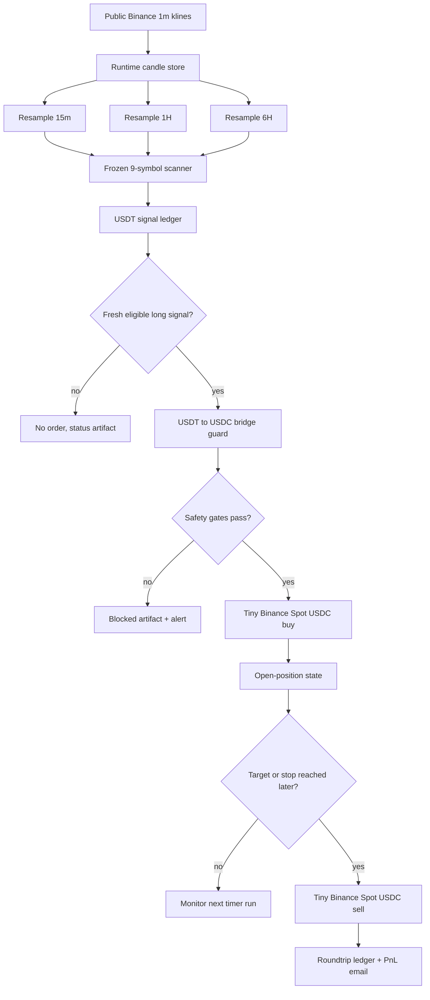
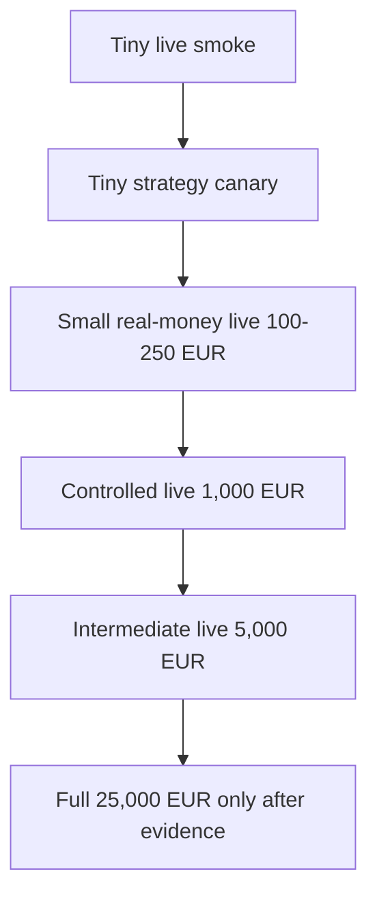

# Crypto Compounding Engine

Production-grade, Dockerized crypto compounding runtime for Hetzner.

This repository is the cleaned production extraction of the larger local research workspace. It is not the legacy Retail Trading System application. It is the operational Crypto Compounding Engine: public market data in, deterministic frozen signal logic, clear artifacts out, guarded Binance Spot execution only when explicitly enabled.

Current status: guarded real-money canary is ready and running on Hetzner with tiny USDC caps. Full €25,000 deployment is not a switch; it is a gated promotion after the canary proves order lifecycle, state recovery, email clarity, and balance reconciliation.

---

## Executive verdict

| Area | Current answer |
| --- | --- |
| Production repo | `nneupane1/Crypto-Compounding-Engine` |
| Cloud target | Hetzner CPX22, Falkenstein, Docker Compose |
| Active strategy universe | 9 symbols |
| Signal quote route | USDT |
| Live execution quote route | USDC |
| Runtime cadence | every 5 minutes |
| Data source | public unsigned Binance klines |
| Execution product | Binance Spot only |
| Short selling | disabled for live execution |
| Margin/futures | disabled |
| Withdrawals/transfers | disabled |
| Current real-money mode | tiny guarded canary only |
| Full €25k live mode | not enabled yet |

The main production idea is simple:

```text
USDT market signal brain  ->  USDC live execution hand
```

The engine watches the deeper USDT markets because they have better historical continuity and stronger research evidence. For live EEA/Binance access, it executes through matching USDC Spot pairs because that is the practical route available in the account environment.

That split is not a hack. It is the useful engineering compromise: keep the best signal source, execute through the allowed live route, and verify the bridge with hard evidence.

---

## Current frozen production candidate

| Item | Value |
| --- | --- |
| Frozen court | `multi_asset_earned_parallel_slot_btc_inclusion_court_001` |
| Universe id | `btc_research_ranked_9_symbol` |
| Classification | `MULTI_ASSET_9_SYMBOL_BTC_INCLUSION_FREEZE_CANDIDATE_RESEARCH_ONLY` |
| USDT → USDC bridge classification | `USDT_SIGNAL_USDC_EXECUTION_2PCT_GUARDED_CANDIDATE_FROZEN_RESEARCH_ONLY` |
| Active symbols | `ADAUSDT`, `LINKUSDT`, `BNBUSDT`, `XRPUSDT`, `AVAXUSDT`, `DOGEUSDT`, `ETHUSDT`, `BTCUSDT`, `SOLUSDT` |
| Context frames | `1m`, `15m`, `1H`, `6H` |
| 6H overlay | `MULTI_ASSET_6H_CONTEXT_OVERLAY_FREEZE_CANDIDATE_RESEARCH_ONLY` |
| Execution style | long-only Binance Spot for live/canary |
| Research result after costs + yearly tax reserve | `€5,393,682.06` from `€25,000` |
| Bridge research result after costs + yearly tax reserve | `€5,333,441.95` from `€25,000` |

The important number is not a fantasy “gross moon number”. The relevant production-candidate number is the guarded, cost-aware, tax-reserve-aware USDT-signal → USDC-execution result around `€5.33M–€5.39M` from a `€25k` starting anchor in research.

That is why this version is the current production candidate.

---

## Why USDT signals and USDC execution

### USDT is the signal brain

USDT pairs were kept as the canonical signal source because:

- they have deeper Binance history;
- they support the long research validation trail;
- the frozen 9-symbol scanner was proven on USDT-quoted market behavior;
- USDT markets are generally the more liquid signal tape;
- the existing frozen research artifacts, decision logic, and 6H overlay are already anchored there.

### USDC is the live execution hand

USDC pairs were introduced because:

- the Binance account environment exposed USDC as the practical live stablecoin route;
- Spot USDC pairs support long-only buy/sell behavior;
- live execution can be tested with tiny real money;
- it avoids margin/futures/short-selling complexity;
- the bridge can compare USDT signal behavior against USDC executable market prices.

### Why this is strong

The clean design is:

1. observe the richer USDT market;
2. confirm that the matching USDC pair behaves close enough;
3. execute only tiny, guarded, long-only Spot orders;
4. record every order, fill, state file, email, and PnL artifact;
5. scale only after the bridge proves itself.

This keeps the “brain” and the “hand” separate. The brain decides. The hand executes. The hand is currently wearing training gloves.

---

## System flow



---

## Hetzner production layout

| Component | Role |
| --- | --- |
| `runtime` container | always-on market data + frozen signal engine |
| `rts-live-canary-usdc.timer` | systemd timer checking for fresh signals every 5 minutes |
| `live-canary` Docker profile | tiny real-money USDC execution bridge |
| `live-smoke` Docker profile | one-off buy/sell plumbing test |
| `dashboard-api` | read-only telemetry API |
| `dashboard` | lightweight production Next.js monitor |

Persistent Docker volumes:

| Volume | Purpose |
| --- | --- |
| `rts_output` | runtime artifacts, ledgers, alerts, status JSON |
| `rts_data` | checkpointed runtime candle data |

The production image intentionally does not ship the huge historical research archives. It ships runtime code, configuration, deployment files, and lightweight seed/context material only.

---

## Runtime artifact map

| Artifact area | Meaning |
| --- | --- |
| `structural_compounding_lab/output/multi_symbol_forward_runtime_earned_parallel_slots/` | active USDT signal runtime |
| `ledger/multi_symbol_forward_decision_ledger.csv` | frozen strategy decision/event ledger |
| `symbol_runtime_snapshots/<symbol>/` | per-symbol runtime candle snapshots |
| `alerts/multi_asset_trade_events/` | USDT signal emails and drafts |
| `structural_compounding_lab/output/binance_live_strategy_canary_court_001/` | guarded USDC live canary |
| `ledger/live_canary_orders.csv` | Binance order records |
| `ledger/live_canary_fills.csv` | fill records |
| `ledger/live_canary_roundtrips.csv` | closed buy/sell PnL records |
| `alerts/latest_live_canary_email.txt` | latest canary plain-text email draft |
| `alerts/latest_live_canary_email.html` | latest canary HTML email draft |

---

## Email streams

There are two different streams. They are deliberately named differently.

| Stream | Meaning | Sends when |
| --- | --- | --- |
| `RTS LIVE SIGNAL SCHEDULER` | USDT walk-forward signal event | frozen signal entry/exit row appears |
| `RTS LIVE CANARY` | tiny USDC real-money order event | Binance buy/sell fills |

Signal emails are not Binance orders.

Canary emails are Binance order lifecycle emails.

Both now use the same clean layout:

- large headline;
- clear entry/exit type;
- `CONGRATULATIONS — PROFIT +X` on profitable exits;
- `OOPS — LOSS -X` on losing exits;
- total equity at the top;
- source symbol;
- execution symbol;
- trade technicals;
- PnL and cost fields;
- safety gates;
- plain-text and HTML artifacts.

---

## What “ready to trade real money” means here

This system is ready for guarded tiny real-money validation.

It is not yet approved for full €25,000 autonomous live deployment.

The current real-money readiness means:

- Binance Spot API connectivity works from Hetzner;
- dedicated API keys are used;
- withdrawals are disabled;
- generic/demo keys are rejected;
- USDC balance is available;
- one tiny buy/sell smoke already proved the path;
- the canary can place at most one tiny order when a fresh frozen signal appears;
- max order is capped;
- max daily loss is capped;
- artifacts and emails are written.

The full-capital readiness still requires evidence from the canary period.

---

## Promotion ladder



| Stage | Capital | Purpose |
| --- | ---: | --- |
| Tiny smoke | ~`6 USDC` order | prove buy/sell plumbing |
| Canary | tiny capped orders | prove fresh signal → order → exit lifecycle |
| Small live | `€100–€250` | validate real-world fills and emails |
| Controlled live | `€1,000` | validate repeated live behavior |
| Intermediate live | `€5,000` | validate scaling and slippage |
| Full live | `€25,000` | only after gates pass |

---

## Hard safety contract

| Guard | Current status |
| --- | --- |
| Full live trading | disabled |
| Paper validation flag | `paper_validation_ready=false` |
| Live strategy order path | disabled except explicit tiny canary |
| Mainnet tiny canary path | guarded and capped |
| Short-selling | disabled |
| Margin | disabled |
| Futures | disabled |
| Withdrawals | disabled |
| Account transfers | disabled |
| Generic Binance keys | rejected |
| Demo keys in live path | rejected |
| Historical backlog replay | blocked by default |
| Duplicate order prevention | state/ledger based |
| Max open positions in canary | `1` |
| Current canary max order | `6 USDC` |
| Current canary daily loss cap | `3 USDC` |

---

## Why full historical data is not in this repo

The local research workspace contains heavy data and court artifacts. This production repo intentionally does not.

Excluded from production:

- full `data_storage/` archives;
- generated `structural_compounding_lab/output/`;
- old backtest CSVs;
- historical court output trees;
- local virtual environments;
- `.env`;
- `dashboard/node_modules`;
- `dashboard/.next`;
- Mac LaunchAgent files.

Included in production:

- runtime code;
- frozen scanner code;
- USDT → USDC execution guard;
- Docker deployment files;
- systemd timer templates;
- lightweight dashboard/API;
- runtime seed/context files where needed;
- documentation and runbooks.

---

## Repository hygiene status

The production repository is intentionally small compared with the local
research workspace, but it still contains more than a single “bot script”
because the live runtime depends on frozen court logic, cost guards, bridge
guards, and replay-tested helper modules.

| Area | Status | Why it remains |
| --- | --- | --- |
| `production_runtime/` | required | always-on Docker scheduler loop |
| `production_api/` | required | read-only dashboard/API telemetry |
| `deploy/` | required | Hetzner Docker and systemd operation |
| `structural_compounding_lab/shadow_forward/` | required | frozen 9-symbol signal runtime |
| `structural_compounding_lab/execution/` | required | Binance smoke/canary execution bridges |
| `structural_compounding_lab/diagnostics/` | retained source | the active runtime imports frozen court helpers from here |
| `structural_compounding_lab/backtest/` | retained source | signal runtime still imports the tested engine components |
| `structural_compounding_lab/runtime_seed/` | intentional lightweight seed | gives cloud runtime recent context without shipping full history |
| `dashboard/` | optional monitor | production source only; no `node_modules` or `.next` should be committed |
| `.env` | excluded | local/cloud secrets only |
| full `data_storage/` | excluded | too large and not needed in the image |
| generated `output/` | excluded | runtime writes this into Docker volumes |

The confusing historical pieces have been removed from the production overview:

- no competing top-level README;
- no tracked `.env`;
- no tracked `node_modules`;
- no tracked `.next`;
- no tracked Python cache files;
- no full historical CSV archive;
- no Mac LaunchAgent dependency;
- no old local OneDrive/Windows path dependency.

If a future cleanup removes retained research modules, it must first replace the
runtime imports with production-native modules and pass the Docker/runtime test
suite. Until then, those files are not dead clutter; they are part of the frozen
evidence chain.

---

## Folder structure

```text
Crypto-Compounding-Engine/
├── README.md                         # authoritative project overview
├── deploy/
│   ├── docker-compose.prod.yml       # production Docker Compose
│   ├── python.Dockerfile             # runtime/API/live-canary image
│   ├── dashboard.Dockerfile          # production dashboard image
│   └── systemd/
│       ├── rts-live-canary-usdc.service
│       └── rts-live-canary-usdc.timer
├── docs/
│   ├── HETZNER_DOCKER_DEPLOYMENT.md
│   ├── LIVE_STRATEGY_CANARY_RUNBOOK.md
│   ├── LIVE_TINY_SMOKE_RUNBOOK.md
│   └── PRODUCTION_MIGRATION_MANIFEST.md
├── production_runtime/
│   └── scheduler_loop.py             # always-on runtime loop
├── production_api/
│   └── main.py                       # read-only telemetry API
├── dashboard/
│   └── ...                           # production dashboard source
├── structural_compounding_lab/
│   ├── shadow_forward/               # 9-symbol signal runtime
│   ├── execution/                    # Binance demo/live/canary bridges
│   ├── diagnostics/                  # frozen research/court code
│   └── ...
└── tests/
    ├── test_usdt_usdc_execution_guard.py
    └── test_live_strategy_canary_email.py
```

Only this root `README.md` should be treated as the production overview. The package-level `structural_compounding_lab/README.md` is intentionally short and points readers back here.

---

## Hetzner commands

Start/restart runtime:

```bash
cd /opt/crypto-compounding-engine
docker compose -f deploy/docker-compose.prod.yml up -d runtime
```

Check runtime:

```bash
docker compose -f deploy/docker-compose.prod.yml ps
docker compose -f deploy/docker-compose.prod.yml logs --tail=200 runtime
```

Check live canary timer:

```bash
systemctl list-timers --all rts-live-canary-usdc.timer --no-pager
systemctl status rts-live-canary-usdc.timer --no-pager
```

Run canary status with no order:

```bash
docker compose -f deploy/docker-compose.prod.yml --profile live-canary run --rm \
  live-canary python -m structural_compounding_lab.execution.live_strategy_canary_bridge --mode status
```

---

## Local production rehearsal

```bash
cp .env.example .env
docker compose -f deploy/docker-compose.prod.yml build
docker compose -f deploy/docker-compose.prod.yml up -d runtime dashboard-api dashboard
docker compose -f deploy/docker-compose.prod.yml logs -f runtime
```

Dashboard:

```text
http://127.0.0.1:3000/structural-lab
```

API:

```text
http://127.0.0.1:8000/health
```

---

## Runbooks

| File | Purpose |
| --- | --- |
| `docs/HETZNER_DOCKER_DEPLOYMENT.md` | server setup and Docker operations |
| `docs/LIVE_TINY_SMOKE_RUNBOOK.md` | one-off tiny buy/sell plumbing test |
| `docs/LIVE_STRATEGY_CANARY_RUNBOOK.md` | fresh frozen signal → tiny USDC execution test |
| `docs/PRODUCTION_MIGRATION_MANIFEST.md` | what was included/excluded from production |
| `docs/REPOSITORY_STRUCTURE_AUDIT.md` | why each major folder remains and what must stay excluded |

---

## Final conclusion

The current production architecture is coherent:

- USDT remains the best signal tape.
- USDC is the practical Spot execution route.
- The bridge was researched and frozen as a candidate.
- The Hetzner Docker runtime is separated from the local research machine.
- The canary is tiny, capped, and real-money guarded.
- Emails and artifacts now clearly separate signal events from Binance order events.
- The system is ready for real-money canary validation, not full €25k deployment yet.

The “brilliant” part is not that the bot can press buy. Any script can press buy. The serious part is that this one has a chain of evidence, a frozen signal engine, a quote-route bridge, hard caps, audit artifacts, restart state, and a promotion ladder.

That is the difference between a button-clicking bot and an operator-grade compounding engine.
